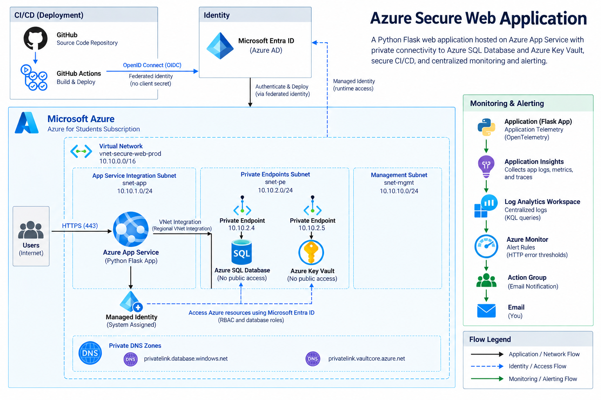

# Secure Azure Web Application

## Azure Cloud Engineering & Security Portfolio Project

A production-inspired Microsoft Azure environment demonstrating hands-on skills in cloud infrastructure, administration, architecture, networking, identity, security, automation, application hosting, and monitoring.

This project deploys a Python Flask web application to Azure App Service and securely integrates it with Azure SQL Database and Azure Key Vault. The environment uses Azure Virtual Network integration, Private Endpoints, Private DNS, Microsoft Entra ID, Managed Identity, role-based access control (RBAC), GitHub Actions with OpenID Connect (OIDC), Application Insights, Log Analytics, Azure Monitor, and Microsoft Defender for Cloud.

The project was designed not only to deploy a working application, but to demonstrate how Azure services can be architected, administered, secured, monitored, and automated using cloud best practices.

## Career Skills Demonstrated

This project demonstrates hands-on skills applicable to:

- **Cloud Engineer** — Azure resource deployment, networking, PaaS integration, identity, monitoring, troubleshooting, and CI/CD
- **Cloud Administrator** — resource management, RBAC, monitoring, configuration, networking, access control, and operational troubleshooting
- **Cloud Architect** — solution design, network segmentation, service integration, private connectivity, identity architecture, availability considerations, and security design
- **Cloud Security Engineer** — least privilege, Managed Identity, Private Endpoints, secrets management, security monitoring, CSPM, and secure CI/CD

## Project Objectives

The primary objectives of this project are to:

- Design a secure Azure cloud architecture using multiple integrated Azure services
- Deploy and administer a Python web application using Azure App Service
- Design a segmented virtual network using dedicated Azure subnets
- Integrate Azure PaaS services using VNet Integration and Private Endpoints
- Implement private DNS resolution for privately connected Azure services
- Secure Azure SQL Database and Azure Key Vault from unnecessary public network access
- Implement passwordless service-to-service authentication using Managed Identity
- Apply least-privilege authorization using Azure RBAC and SQL database roles
- Implement CI/CD using GitHub Actions and OpenID Connect (OIDC)
- Monitor application performance and requests using OpenTelemetry and Application Insights
- Centralize telemetry and analyze events using Log Analytics and KQL
- Detect repeated HTTP failures using Azure Monitor alert rules
- Deliver automated security and operational notifications using Azure Monitor Action Groups
- Assess cloud security posture using Microsoft Defender for Cloud
- Evaluate resources against the Microsoft Cloud Security Benchmark
- Document and automate the infrastructure using Infrastructure as Code

## Solution Architecture

The solution uses Azure Platform as a Service (PaaS) components combined with private networking, identity-based authentication, CI/CD automation, and centralized monitoring.

The architecture separates application hosting, private backend connectivity, identity, deployment automation, and observability into distinct layers.

### Architecture Highlights

- Azure App Service hosts the Python Flask application.
- Azure Virtual Network Integration provides outbound connectivity from App Service into the virtual network.
- Dedicated subnets separate application integration, private endpoints, and management resources.
- Azure SQL Database is accessed through a Private Endpoint.
- Azure Key Vault is accessed through a Private Endpoint.
- Private DNS zones provide name resolution for privately connected Azure services.
- Microsoft Entra Managed Identity provides passwordless runtime authentication.
- Azure RBAC and SQL database roles enforce least-privilege authorization.
- GitHub Actions provides automated application deployment.
- OpenID Connect (OIDC) provides passwordless authentication between GitHub Actions and Azure.
- Application Insights and OpenTelemetry collect application telemetry.
- Log Analytics centralizes telemetry for analysis using KQL.
- Azure Monitor detects repeated HTTP errors and sends notifications through an Action Group.
- Microsoft Defender for Cloud provides cloud security posture management using Foundational CSPM and the Microsoft Cloud Security Benchmark.

### Architecture Diagram

## Identity & Access Management

The solution uses Microsoft Entra ID and managed identities to minimize the use of stored credentials and implement least-privilege access.

### Application Runtime Identity

Azure App Service uses a **system-assigned managed identity** to authenticate to backend Azure services.

The application requests Microsoft Entra ID access tokens at runtime instead of storing database passwords or service credentials in the application code.

The managed identity is used to access:

- **Azure SQL Database** using Microsoft Entra authentication
- **Azure Key Vault** using Azure RBAC

For Azure SQL Database, the App Service managed identity is configured as a database user and granted only the permissions required by the application:

- `db_datareader`
- `db_datawriter`

The application is not granted `db_owner`.

For Azure Key Vault, the App Service managed identity is assigned the:

- `Key Vault Secrets User`

role at the Key Vault scope.

This allows the application to retrieve secrets while preventing unnecessary secret-management permissions.

### CI/CD Identity

GitHub Actions uses **OpenID Connect (OIDC)** and Microsoft Entra workload identity federation to authenticate to Azure.

This eliminates the need to store a long-lived Azure client secret in the GitHub repository.

The deployment identity is granted:

- `Website Contributor`

scoped to the Azure App Service.

This separates deployment permissions from the application's runtime permissions.

### Identity Architecture

Two separate identities are intentionally used:

| Identity | Purpose | Access |
|---|---|---|
| GitHub federated identity | CI/CD deployment | Deploy application to Azure App Service |
| App Service system-assigned managed identity | Application runtime | Access Azure SQL Database and Azure Key Vault |

Separating deployment and runtime identities reduces privilege exposure and follows the principle of least privilege.

## Security Controls

Security was incorporated throughout the architecture rather than added only after deployment.

### Network Security

- Azure SQL Database uses a Private Endpoint.
- Azure Key Vault uses a Private Endpoint.
- Public network access is disabled for backend services during normal operation.
- Private DNS zones provide name resolution for Private Link resources.
- Dedicated subnets separate application integration, private endpoints, and management resources.
- Network Security Groups are used to define network traffic controls.

### Identity Security

- Microsoft Entra ID provides centralized identity.
- Managed Identity eliminates stored runtime credentials.
- GitHub Actions uses OIDC instead of a long-lived Azure client secret.
- Azure RBAC implements least-privilege access.
- SQL database permissions are limited to required read/write roles.

### Secrets Management

Azure Key Vault provides centralized secrets management.

The Flask application retrieves secrets at runtime using its managed identity instead of embedding secrets directly in source code.

### Security Posture Management

Microsoft Defender for Cloud Foundational CSPM is enabled with full monitoring coverage.

The **Microsoft Cloud Security Benchmark (MCSB)** is enabled at the subscription level to provide security posture assessments and recommendations.

Paid Defender workload protection plans were intentionally not enabled for this lab to maintain cost control while retaining foundational CSPM capabilities.
